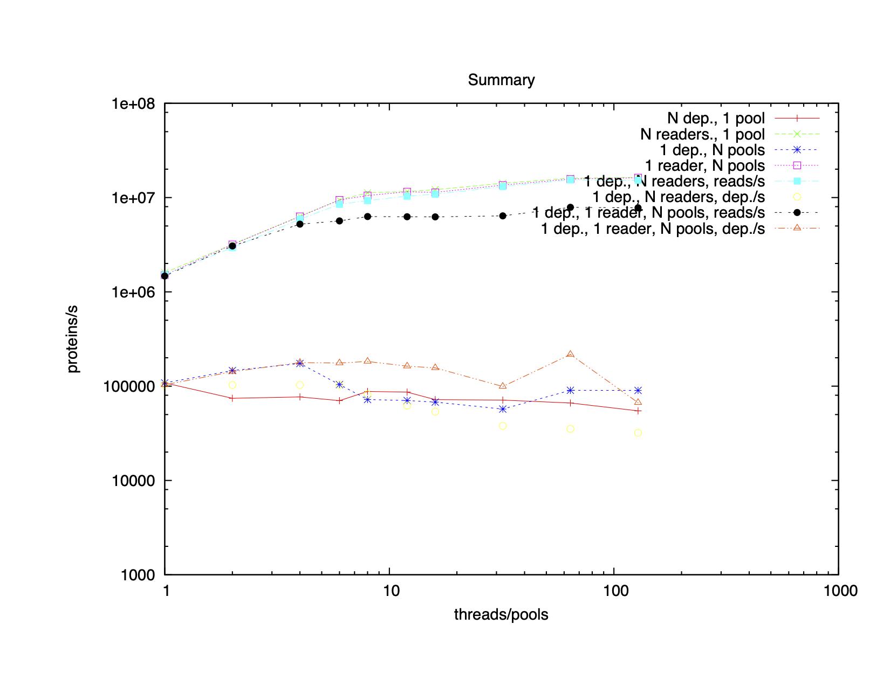

Documentation files in this directory:

- plasma.txt - good place to start; explains general idea of plasma
- issues.txt - place for keeping track of open questions to be resolved
- slaw-v1.txt - documentation of old binary slaw format; old for compatibility
- slaw-v2.txt - documentation of the binary slaw fomrat which is currently used
- pool-tcp-protocol.txt - documentation of the wire protocol for TCP pools

Explanation of subdirectories:

- private - place where header files internal to libPlasma are kept
- win32 - old Windows port, currently bitrotting
- perf - performance tests
- tests - tests applicable to both mmap and tcp pools
- tests-mmap-only - tests applicable only to mmap pools
- t - tests that don't use pools (i. e. slaw tests)

The performance tests must be run manually, and they generate various
graphs and stuff.  The other three test directories produce a
pass/fail result, and are run automatically by ibat.  (ibat runs the
three directories differently, depending on which types of pools they
are applicable to; i. e. "tests" is run twice-- once with mmap pools
and once with tcp pools)

The performance tests in libPlasma/perf also produce gnuplot graphs
automatically. The graph format is simple to adjust - just set one or two
variables to the proper gnuplot values. During development, I (Val Henson) used
ASCII graphs printed to stdout for quick feedback, and save pretty color
postscript graphs for final runs. All this and more is documented in the
`run_all.sh` script. Here is an example graph:

